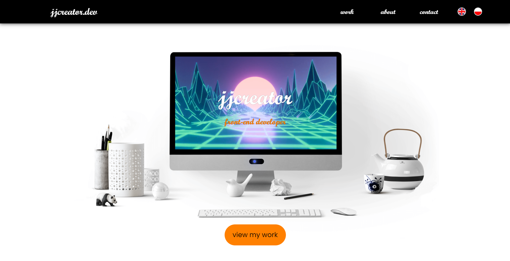

# My portfolio - jjcreator.dev

My portfolio website, showcasing my projects and skills. Clean design with some special effects to make it more fun and interactive. 

## Technologies

* HTML
* CSS
* Javascript
* Gimp & Figma (design)

## About

A small portfolio site created to serve as my business card in the IT world. It showcases my favourite projects and tells the visitor a little bit more about myself - not only my current technical skills, but also who am I as a person. I used Figma and Gimp to work on the design, learning much in the process. The page is hosted on Netlify using the current build from GitHub.

#### Main features

* hero section with a video background inside a picture to create an illusion of a working monitor screen. The monitor can be "turned off" and back "on" via a toggle.
* projects section
* contact form with html validation + additional honeypot field for spam prevention (on top of what Netlify already employs as a default)
* available in English and Polish - full translation at the click of a button
* responsive
* animations using animate-on-scroll + some simple custom ones

## Launch

Domain registered through a registrar, page hosted on Netlify. Launched as https://www.jjcreator.dev

## Sources

Video and images from pexels.com and pixabay.com. Animated with animate-on-scroll (https://michalsnik.github.io/aos/). 
